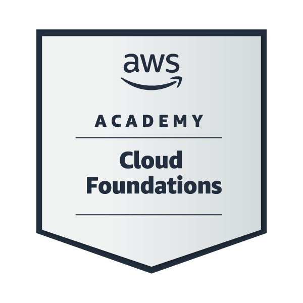

<h1 align="center">👋 Hey there! I'm Tray Haroun</h1>

  🧑‍💻 Software Engineer | DevOps Enthusiast  
   
  🌍 Sousse, Tunisia  
   
  📩 harountray33@gmail.com  

  
  
  
  

  
  
  
  

  

---

## 🌟 About Me

I am a motivated and versatile **Software Engineer** with solid experience in **web development, cloud computing, and DevOps practices**.  
My academic background and professional journey have shaped me into a **problem-solver** who enjoys building scalable, efficient, and secure software solutions.

I specialize in:
- **Backend & Full-Stack Development (Java, Spring Boot, Node.js, Angular, React)**
- **Cloud & DevOps (AWS, Azure, Docker, Kubernetes, CI/CD, Terraform)**

My career goal is to continuously grow as a **Software Engineer & DevOps Professional**, delivering high-quality solutions while learning cutting-edge technologies and contributing to impactful projects.

---

## 🎯 What I’m Currently Working On

- 🚀 **Completing my DevOps Bootcamp (TechWorld with Nana)**
- 🔥 **Deep Learning Project (MERN Stack-based)**
- 🌐 **Java Spring Boot & Angular Project**
- 🗃️ **Database Management & Optimization Project**
- 📱 **iOS Crash Course & Mobile Project**

---

## 📚 What I’m Learning

- 🌩️ **Advanced DevOps & Cloud Tools (AWS, Terraform, Kubernetes, Jenkins)**
- 🖥️ **Java Spring Boot & Angular Full-Stack Development**
- 🧠 **Deep Learning & AI Integration in Web Apps**
- 📊 **Database Optimization & SQL Performance**
- 🔐 **DevSecOps Essentials**

---

## 🎓 Education

- 🎓 **Engineer’s Degree in Computer Science**  
  *EPI - International Multidisciplinary School (2023 - 2026)*

- 🎓 **Bachelor’s Degree in Computer Science**  
  *Higher Institute of Computer Science Mahdia (2020 - 2023)*

- 🎓 **Baccalaureate in Experimental Sciences (With Honors)**  
  *OKba High School (2015 - 2020)*

---

## 💼 Professional Experience

### 🚀 **Software Developer - Smartovate**
*Dec 2023 - Feb 2024 | Sousse, Tunisia*
- Built a complete **Django microservices** system and contributed to mobile app integration.
- Managed **backend & frontend integration**.
- Deployed services on **Azure** ensuring scalable infrastructure.
- Mentored junior interns in development.

### 🌐 **Backend & Mobile Developer Intern - Caustaza Group**
*Aug 2023 - Dec 2023 | London, UK*
- Transitioned from intern to mobile & backend developer.
- Built backend services with **Django**.
- Managed deployment on **Azure**.

### 🏗️ **PFE Intern - ITMador**
*Feb 2023 - Jun 2023 | Mahdia, Tunisia*
- Developed **BMC Project** using the **MEAN Stack**.

### 🖥️ **Intern - IAMAPS**
*Jul 2021 - Aug 2021 & Jul 2022 - Aug 2022 | Mahdia, Tunisia*
- Worked on projects using **Node.js, AngularJS, MongoDB**.

---

## 🛠️ Tech Stack (Languages & Tools)

  <!-- Languages -->
  
  
  
  
  
  
  
  
  
  
  
  
  
  
  
  
  
  
  
  
  
  
  
  
  
  
  
  
  
  
  
  
  
  

---

## 📜 Certifications

  
  &nbsp;&nbsp;
  
  &nbsp;&nbsp;
  

  
  &nbsp;&nbsp;
  
  &nbsp;&nbsp;
  
  &nbsp;&nbsp;
  

---
## 📬 Connect With Me

  
  &nbsp;&nbsp;&nbsp;
  

---
## 📊 GitHub Stats & Activity

### 🎯 Contribution & Profile Insights

<table align="center">
  <tr>
    <td align="center">
      
    </td>
    <td align="center">
      
    </td>
  </tr>
  <tr>
    <td align="center">
      
    </td>
    <td align="center">
      
    </td>
  </tr>
</table>

---

### 🟢 Contribution Graph 

  

